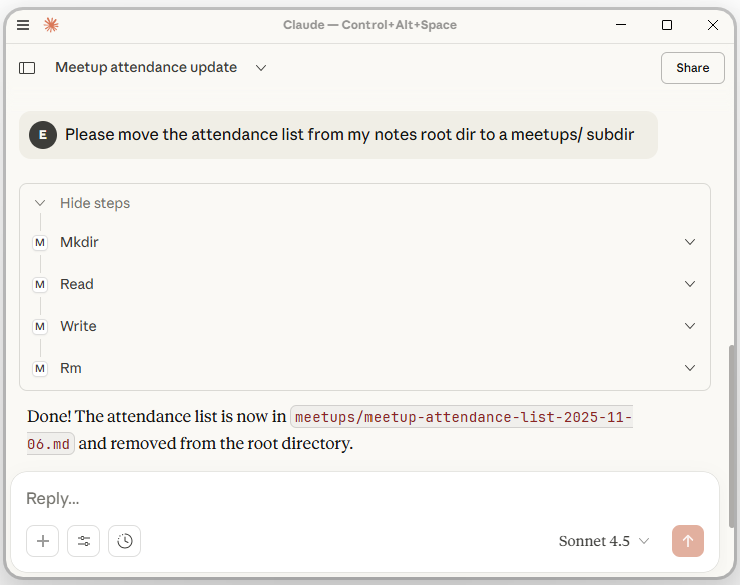

# Notes MCP server
A simple MCP server for chatbot/human collaborative management of text content.

Content files, *notes*, are stored as markdown files with YAML frontmatter, a format commonly used to [organize blog posts](https://jekyllrb.com/docs/front-matter/).
Having metadata associated with the notes is useful for various things, such as timestamping and searchability.

I use the server as
- a means to improve my own own productivity, through management of blog content, general notes and other things.
- a demo project, for showing and reasoning about the capabilities of LLM tool usage.

## Tool usage and model context protocol (MCP)
*Tool usage* is the concept of having an LLM invoke software functions when they receive input that warrants it.
The [*model context protocol*](https://modelcontextprotocol.io/docs/getting-started/intro) is a standard whose main purpose is to define conventions for how tool usage should be implemented.
Here is an example of the present MCP server in action, in conjunction with an official Gmail tool server:


## Try out the server

1. Get [Claude desktop](https://claude.ai/download) and the [uv](https://docs.astral.sh/uv/) Python package manager.

2. Put this in the `claude_desktop_config.json` file of your Claude installation (with an updated path to an existing folder called "my-notes"):
```json
{
  "mcpServers": {
    "my-notes": {
      "command": "uvx",
      "args": ["notes-mcp", "C:\\Users\\me\\path\\to\\my-notes"]
    }
  }
}
```

3. (Re-) Start Claude desktop and check in the chat input toolbar that "my-notes" and "Web search" are activated.

4. Tell Claude "github.com/edvardlindelof/notes-mcp seems like an awesome package, check it out and save a small TODO about sharing it with others in my notes".

5. Did your LLM hallucinate? Then open the note in your favorite editor and correct it. Work collaboratively!

## Implementation
The server is built with [FastMCP](https://gofastmcp.com/) and implements the operations read, write, glob, mkdir, rm, rmdir and search.
Most of them are very simple, here is mkdir:
```Python
@mcp.tool()
def mkdir(path: str) -> str:
    """Create a directory."""
    (root_dir / path).mkdir(parents=True, exist_ok=True)
    return f"Directory created: {path}"
```

## Some cool aspects of LLM tool usage implementation
Here are some things about LLM tool usage implementation that I find particularly powerful or fascinating!

### Activating multiple tool servers is a means of instant integration
By activating multiple tool servers, you make your chatbot an integration interface between them.
Above, you saw one example involving Gmail inbox parsing and another involving web fetch.
Some wild possibilities emerge if you consider the range of available MCP servers out there.
Try out what can be done with the [Playwright MCP](https://github.com/microsoft/playwright-mcp) for automating web browsing, for example.
Have it parse some web pages you're interested in and save the results with Notes MCP :).

### The flexibility provided by the LLM lets you implement less
With the LLM responsible for figuring out the details of which tools to invoke and how, the chatbot becomes a very flexible UI.
This often lets us be minimalistic about the set of tools that we implement.
There is an example above: you may have noticed that while operations for reading, writing and deletion were listed, there is none for moving or renaming.
This is deliberately omitted from the server because the LLM can figure out the workaround (read -> write -> delete) easily enough:



Don't jump straight to implementing every conceivable tool, but think about which ones are necessary to achieve value!

### Tools can reverse delegate work to the LLM through their documentation
While the standard principle is that the LLM invokes tools to have work done, tools can also "fool" the LLM to do work upfront, using documentation.
Example: if you study notes_mcp.py, you will find that there is no code in there for converting text to YAML (or markdown).
This is instead delegated to the LLM by prompting it for already formatted YAML and markdown - all that is needed are the words "YAML" and "markdown" in the argument names:
```Python
@mcp.tool()
def write(path: str, yaml_frontmatter: str, markdown_content: str) ...
```
Delegating text formatting work to the LLM is appropriate because LLMs, while unreliable for many things, excel at syntax and formatting.
This particular case of reverse delegation is a small example of something that can be much more elaborate.
Typical chat LLMs will, for example, effectively and correctly populate large JSON strings as long as a template is included in the docstring.

## Experiment with the server locally

1. Clone this repo.

2. Modify your `claude_desktop_config.json` to include this:
```json
{
  "mcpServers": {

    // ... other mcp servers go here ...

    "my-notes-local": {
      "command": "uv",
      "args": [
        "run",
        "--directory",
        "C:\\Users\\me\\path\\to\\notes-mcp",
        "notes-mcp",
        "C:\\Users\\me\\path\\to\\my-notes"
      ]
    }

  }
}
```

3. Modify something in the code, then restart Claude desktop to try out the changes.