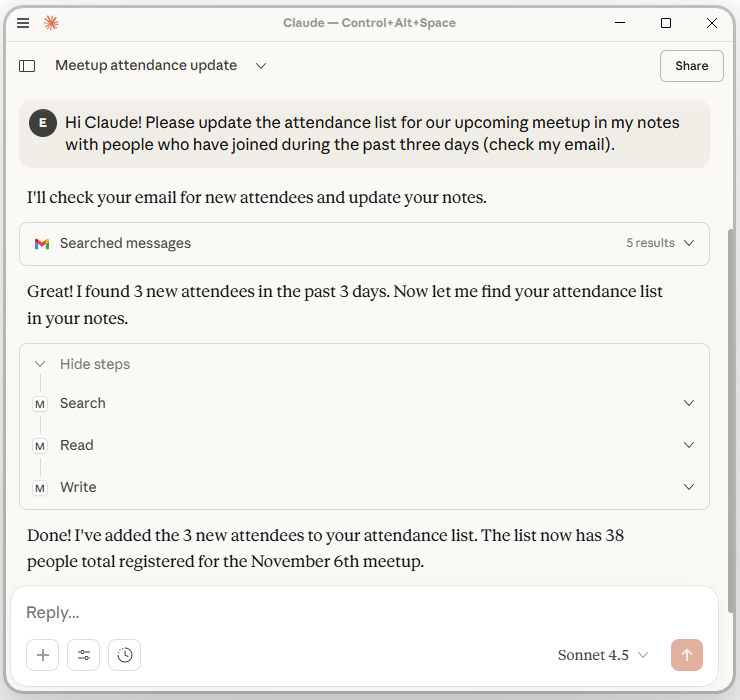

# Notes MCP server
A simple MCP server for chat bot/human collaborative management of text content.

I use the server as
1. a means to improve my own own productivity, through management of blog content, general notes and other things.
2. a demo project, for showing and reasoning about the capabilities of LLM tool usage.

Content files, *notes*, are stored as markdown files with YAML frontmatter, a format commonly used to [organize blog posts](https://jekyllrb.com/docs/front-matter/).
Having metadata associated with the notes is useful for various things, such as timestamping and searchability.

## Tool usage and model context protocol (MCP)
*Tool usage* is the concept of having an LLM call programming functions when they receive input that warrants it.



The [*model context protocol*](https://modelcontextprotocol.io/docs/getting-started/intro) is a standard whose main purpose is to define conventions for how tool usage should be implemented.

Some interesting aspects of LLM tool usage are
- **instant integration**: by activating multiple tool servers, you make your chat bot an integration interface betwen them.
- **flexibility and minimalism**: because the LLM handles the inputs and outputs of the tool usage, it is very flexible often able to deliver high value with a small number of tools.
- **reverse delegation of work to the LLM**: tools do work for LLMs, but also define expected input in their documentation, allowing them to "fool" the LLM to do the work when appropriate.

You saw an example of instant integration, of Gmail and notes-mcp, in the screenshot above.
You will find examples of the next two points below.

## Implementation
The server implements the operations read, write, glob, mkdir, rm, rmdir and search.
Most of them are very simple, here is mkdir:
```Python
@mcp.tool()
def mkdir(path: str) -> str:
    """Create a directory."""
    (root_dir / path).mkdir(parents=True, exist_ok=True)
    return f"Directory created: {path}"
```

### Q: shouldn't there be an operation for moving files?
A: there could be, but it is not needed, because the LLM is flexible enough to figure out the workaround.

TODO screenshot of rm/write

This is a small example of how tool server implementation lends itself to *minimalism* - you typically don't have to implement every conceived tool to achieve tangible value within your business context!

### Q: where is the code for converting text to markdown and YAML?
A: the server contains no code for creating YAML or markdown content, but *reverse delegates* this to the LLM.
All that is needed for the LLM to know what to do are the words "YAML" and "markdown" in the argument names:
```Python
@mcp.tool()
def write(path: str, yaml_frontmatter: str, markdown_content: str) ...
```
Delegating text formatting work to the LLM is appropriate because LLMs, while unreliable for many things, excel at syntax and formatting.
These argument names exemplify how the function documentation (including signature) effectively works as an LLM prompt.
The prompt can be much more elaborate - think data classes/contracts!

## Quickstart

1. Get [Claude desktop](https://claude.ai/download).

2. Put this in your `claude_desktop_config.json`, with an updated path to an existing folder called "my-notes".
```json
{
  "mcpServers": {
    "my-notes": {
      "command": "uvx",
      "args": ["notes-mcp", "/home/me/path/to/my-notes"]
    }
  }
}
```

3. (Re-) Start Claude desktop and check in the chat input toolbar that "my-notes" and "Web search" are activated.

4. Tell Claude "github.com/edvardlindelof/notes-mcp seems like an awesome package, check it out and save a small TODO about sharing it with others in my notes".

5. Did your LLM hallucinate? Then open the note in your favourite editor and correct it. Work collaboratively!

Supported systems: developed and tested on Linux. It may work directly on Windows - if not, the workaround is to use `"command": "docker"` or `"command": "wsl"` and put an adapted version of the `uvx` command in `"args"`.